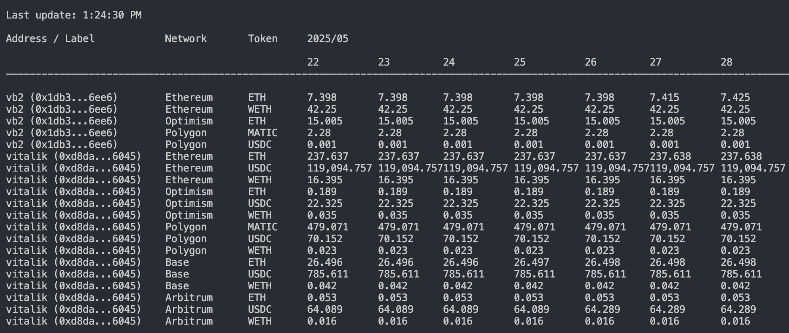

# Wallet Tracker

Track historical wallet balances across any EVM-compatible network with support for native tokens and custom ERC20 tokens.

## Prerequisites

- Node.js v22+
- pnpm

## Installation

```sh
pnpm install
```

## Configuration

Edit `config.toml` to set up:

- Networks (id, name, rpc_url, native_token, tokens)
- Wallet addresses file
- `history_days` (number of days to backfill)

Create a `.env` file containing all the RPC URLs used in `config.toml`

## Usage

**Fetch balances (historical & current):**

```sh
pnpm dev-fetcher
```

**Terminal UI:**

```sh
pnpm dev-ui
```



- Data is stored in `data/balances.db` (SQLite)
- Only missing or outdated data is fetched

## Future Plans

- [ ] Web UI with interactive charts and filters
- [ ] Show Uniswap v3/v4 position fees

---

For issues or improvements, open a PR or issue.
